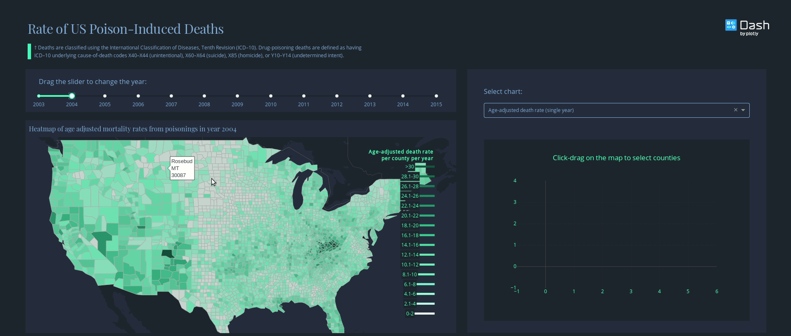

# US opioid epidemic dataset and Dash app

Poison induced death data was downloaded from [CDC Wonder](dash_app_screencast.gif), using cause-of-death codes X40–X44 (unintentional), X60–X64 (suicide), X85 (homicide), or Y10–Y14 (undetermined intent).

[View the Dash app](https://dash-gallery.plotly.host/dash-opioid-epidemic/)

## Getting Started

### Running the app locally
We suggest you to create a separate virtual environment running Python 3 for this app, and install all of the required dependencies there. Run in Terminal/Command Prompt:

```
export FLASK_APP=app.py
export FLASK_ENV=development
flask run -h localhost -p 3000
#in new terminal window
ssh -N -f -L 8884:localhost:3000 bbutler@rmi.org@104.42.97.219 

#now navigate to local host 8884
```
git clone https://github.com/plotly/dash-sample-apps
cd dash-sample-apps/apps/dash-opioid-epidemic
python3 -m virtualenv venv
```
In UNIX system: 

```
source venv/bin/activate
```
In Windows: 

```
venv\Scripts\activate
```

To install all of the required packages to this environment, simply run:

```
pip install -r requirements.txt
```

and all of the required `pip` packages, will be installed, and the app will be able to run.




Dash app inspired by [this Tableau dashboard](https://www.cdc.gov/nchs/data-visualization/drug-poisoning-mortality/)
